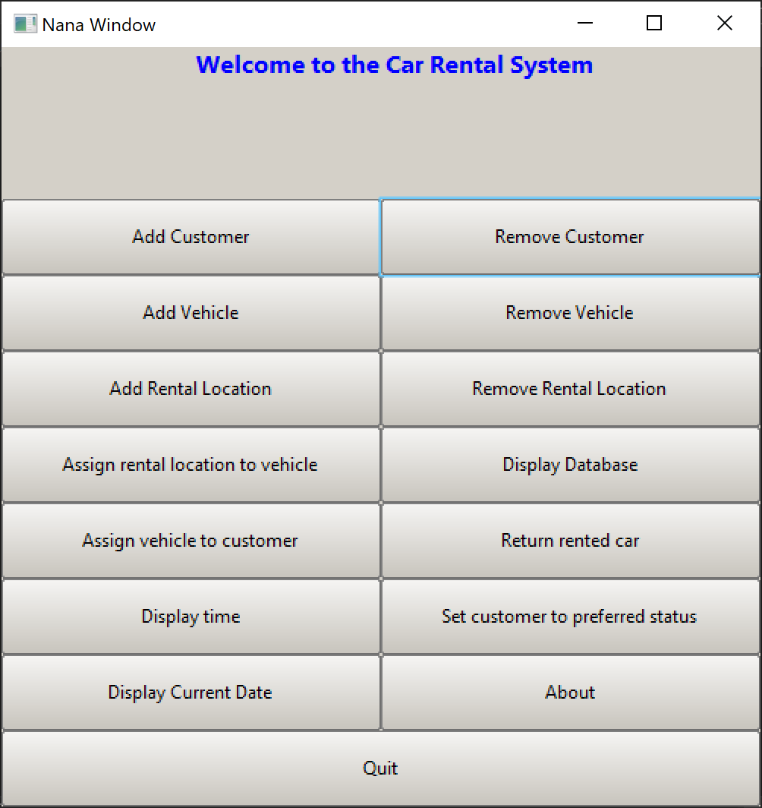

# Nana-Vehicle-GUI-

A graphical user interface coded in C++ using [Nana GUI library](http://nanapro.org/en-us/)
and Visual Studio

This GUI allows the user to add/remove vehicles, customers and rental locations, assign a vehicle to a rental location as well as allowing a customer to rent a vehicle along with other features
that will be coming soon. When executing the program, you will find that 2 vehicles, customers and rental locations have already been created. This is to give the user an idea of how
the program works without having to add a customer, vehicle and rental location from scratch. The process can be tedious because there are multiple attributes for each one.
The main project is called Final Project because this was from an assingment that i submitted as part of a course i was taking in college
